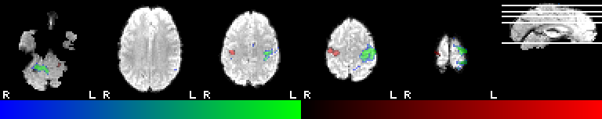

# Volume to bitmap creation

Starting with niimath version v1.0.20251023, the software can now create 2D bitmap images in the PNG format. This feature provides a lightweight way to visualize NIfTI images directly. This repository includes sample images and scripts to demonstrate these features, as well as providing documentation. You can try these out by downloading this repository:

```
git clone https://github.com/rordenlab/niimath-bitmap
cd niimath-bitmap
niimath T1 -m bitmap.png
```

## Sample scripts

Here’s a simple example: we supply a volume (T1) and create a bitmap showing slices along the x (left-right), y (posterior-anterior), and z (inferior-superior) axes. Use `-r` to start a new row.

```
niimath T1 -bitmap -x 0.33 0.66 -r -y 0.33 0.66 -r -z 0.33 0.66  basic.png
```


While lower-case `x`, `y` and `z` shows just a slice, the upper case variant shows white lines to indicate the position of other tiles. We also illustrate the viridis color palette (the palette options are gray, red, green, blue, cyan, yellow, bluegreen, redyellow, viridis, magma, inferno, plasma).

```
niimath T1 -bitmap -y 0.33 0.66 -z 0.33 0.66 -X 0.5 -c viridis cross.png 
```


The `-N` allows you to also show a negative colormap. Note we can set the thresholds for the image with `-t` for the background image and `-T` for the overlay. Here we show t-scores that exceed 4 in red, and those less than -4 in blue-green. We also scale the image by a factor of 2 (`-s 2`) with nearest-neighbor interpolation (`-n`). It also shows a 12-pixel high color gradient (`-g 12`).

```
niimath fslmean -bitmap fslt -T 4 7 -N -z 0.22 0.6 0.7 0.8 0.9 -X 0.5 -s 2 -g 12 -n tscores.png
```



With the default scaling, overlay values between the thresholds (e.g., 4–7) use the full colormap range. In the example above, voxels near 4 appear black and those near 7 bright red. Adding the jump flag (`-j`) maps colors from 0 to the upper threshold, so although voxels below 4 remain transparent, those just above 4 start as dark red. The colorbar thus spans 0–7 rather than 4–7.

```
niimath fslmean -bitmap fslt -T 4 7 -N -z 0.22 0.6 0.7 0.8 0.9 -X 0.5 -s 2 -g 12 -n -j jscores.png
```


By default, niimath bitmaps are shown in radiological orientation, similar to FSL's slicer tool. You can flip the left-right dimension to radiological orientation using the `-f` option. Also like fsl's slicer, you can use `-a` (all) as a shortcut for `-x 0.5 -y 0.5 -z 0.5`. 

```
niimath PSR -bitmap -f -a -t 20 80 neurological.png
```


If you provide a NIfTI file as the first argument after `-bitmap` it will be loaded as an overlay image. Here we load a T2-weighted image as the background image, and a lesion mask as an overlay.

```
niimath M2307_T2 -bitmap M2307_lesion -z  0.7 0.75 -y 0.5 0.55 -X 0.3 lesion.png
```


We can use the edge `-e` option to show the border of an overlay.

```
niimath T1 -bitmap GM -e -a edge.png
```


You can chain as many fslmaths/niimath operations before you save a bitmap. This is a nice way to visualize these operations. Here we smooth the image with a 4mm FWHM Gaussian (`-s 4`), threshold to zero voxels with values less than 50 (`-thr 50`), and binarize the image (`-bin`).

```
niimath PSR -s 4 -thr 50 -bin -bitmap -a math.png
```


The `-o` chooses the optimal slice axis: the 2D slice with the maximum area (rows * columns). This is useful for extracting slices from lots of images with different orientations, with the aim of creating thumbnails.

```
niimath T1 -bitmap -o 0.5 -c inferno optimal.png
```


## Documentation

Below the individual arguments are described in detail.

### Tile / layout options (specify slices to include)

These options build a tiled layout of slices (sagittal/coronal/axial).

- `-x <val> [<val> ...]` : sagittal slices. `<val>` may be:
  - Fraction `0..1` (e.g. `0.5` = middle) — computed as `round(frac * (nx-1))`
  - Negative integer `-N` to request absolute slice number `N` (FSL style)
  - Multiple values allowed after a single `-x`
- `-y <val> [<val> ...]` : coronal slices (same semantics as `-x`)
- `-z <val> [<val> ...]` : axial slices (same semantics as `-x`)
- `X`, `Y`, `Z` act like their lowercase counterparts but show white cross lines marking the position of other tiles.
- `-o <val> [<val> ...]` : optimal (largest) slices (same semantics as `-x`)
- `-r` : row separator — forces following tiles onto a new row
- `-a` : alias — adds three slices (middle of x,y,z): equivalent to `-x 0.5 -y 0.5 -z 0.5`
- `-m` : mosaic alias — builds a 3×3 mosaic:
  equivalent to `-x 0.25 0.5 0.75 -n -y 0.25 0.5 0.75 -n -z 0.25 0.5 0.75`
  (where `-n` here is a separator within the alias expansion; note `-n` may be used elsewhere)

### Global image options (apply to entire output)

These are image-wide and may appear anywhere in the `-bitmap` argument list.

- `-g <pixels>` : show colorbar gradient at the bottom with specified height.
- `-f [0|1]` : radiological orientation (default `1`). If omitted the shorthand `-f` sets to `0` (neurological).  
  `isRadiological = 1` means radiological (left appears on image right).
- `-j` : Jump overlay colorbar range, so color is 0..max for threshold min..max.
- `-u [0|1]` : draw left/right labels (default `1`). Omit argument to set to `0`.
- `-n [0|1]` : interpolation order: `0 = nearest`, `1 = linear` (default `1`). If alone, `-n` sets `0`.
- `-N [0|1]` : turn negative colormap on or off.
- `-s <scale>` : output scale factor (float > 0). Example `-s 1.5`.
- `-t <min> <max>` : set base image calibration range (cal_min, cal_max).
- `-T <min> <max>` : set overlay image calibration range (cal_min2, cal_max2).
- `-e` : enable edge rendering (you can supply a threshold elsewhere); presence of `-e` in later args sets `isEdge = 1`.

### Color / LUT options

You can either pass a numeric RGBA quadruple (R G B A, values `0..1`) or a named LUT with optional alpha.

Available named LUTs:
- `none`, `gray`, `red`, `green`, `blue`, `cyan`, `yellow`, `bluegreen`, `redyellow`, `viridis`, `magma`, `inferno`, `plasma`

**Base (tint) color / LUT**
- `-c R G B A` : numeric base tint (applies multiplicatively to grayscale intensities)
- `-c <name> [alpha]` : use named `LUT` for base; `alpha` optional (0..1). If `alpha` omitted, `1.0` is assumed.

Values are stored in `opts->RGBA` and `opts->LUT`.

**Overlay (second) color / LUT**
- `-C R G B A` or `-C <name> [alpha]` : sets overlay LUT / RGBA (stored in `opts->RGBA2` and `opts->LUT2`)

**Background color**
- `-b R G B A` : set the background fill color for empty pixels (values `0..1`) — stored in `opts->RGBA2` if needed.

Notes:
- If you choose named LUTs, the implementation builds a 256-entry LUT by linearly interpolating RGB from a low endpoint to a high endpoint (alpha is constant per LUT as specified).
- Example: `-c red 0.5` will set the base LUT to red with alpha 0.5; `-C blue` sets overlay LUT2 to blue.

### Contrast and brightness

- `-t` sets the voxel intensity threshold minimum and maximum for the background image. For example, `-t 20 200` will draw voxels below 20 as the darkest color, and voxels above 200 as the brightness, and linearly interpolated colors between these extremes. This threshold allows you to adjust the contrast and brightness of the image. In DICOM language, the `window width` is the difference between these two values, and the `window center` is their midpoint.
- `-T` behaves like `-t` but is applied to the overlay image. Values beneath the minimum are not drawn (revealing the background image). Images above this use the overlay's alpha to determine translucency.
- `-N` allows you to apply `-T` to the negative values in the background image.

## Labels

- Left/right labels drawn as 5×4 pixel white marks. Labels are drawn for non-`x` axes only (i.e., coronal and axial tiles).
- Radiological option (`-f`) inverts which side is drawn as `L`/`R`.

## Output and scaling

- By default, the renderer writes the generated image directly to PNG, so one voxel in the volume becomes one pixel in the bitmap.
- If `-s` (scale) is specified and not 1.0, the image will be scaled with linear interpolation, unless you specify `-n` for nearest-neighbor interpolation.

## License / Attribution

This README documents behavior of the `niimath` `-bitmap` exporter implemented by you. Portions of the scaling code are derived from Graphics Gems (resampling algorithm); `stb_image_write` is used to write PNG files.

## Alternatives

- Python and Matlab NIfTI-Image-Converter
 [nii2png](https://github.com/alexlaurence/NIfTI-Image-Converter).
- [FSL](https://fsl.fmrib.ox.ac.uk/fsl/docs/)  includes a utility `slicer` for generating images.
- [med2image](https://github.com/FNNDSC/med2image) is a Python script for generating PNG/JPG bitmaps from DICOM/NIfTI volumes.
- FreeSurfer can generate images, albeit this briefly loads the graphical interface so it is slow and does not support headless usage. For example `freeview -v T1.nii.gz -viewport axial -slice 0 0 20 -ss slice_axial.png`
- [chauffeur_afni](https://afni.nimh.nih.gov/pub/dist/doc/htmldoc/tutorials/auto_image/auto_%40chauffeur_afni.html) provides powerful commands for creating bitmaps.
